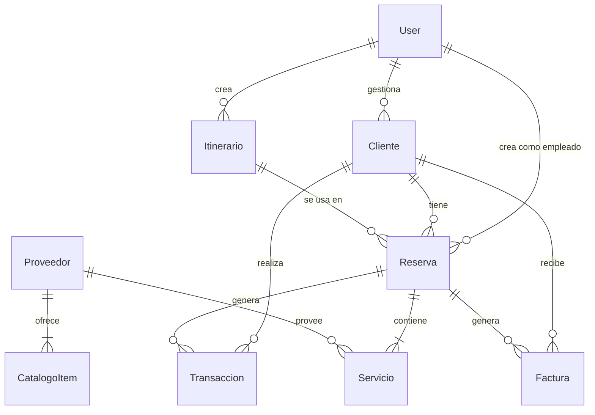

<p align="center">
  
</p>

<h1 align="center">PCE-Agencia</h1>

<p align="center">
  <b>✨ Sistema Integral de Gestión para Agencias de Viajes ✨</b><br/>
  <i>Porque cada destino merece un sistema que vuele tan alto como tus clientes</i>
</p>

<p align="center">
  <a href="https://render.com/deploy?repo=https://github.com/dhardi007/PCE-Agencia">
    
  </a>
</p>

<p align="center">
  
  
  
  
  
</p>

---

## 🧠 ¿Qué es PCE-Agencia?

**PCE** *(Proyecto Casos de Estudio)* es un sistema full-stack diseñado como caso de estudio académico para la gestión operativa de una agencia de viajes. Combina un **backend REST API** con un **dashboard frontend premium** — todo en un solo despliegue.

> *"No es solo un CRUD, es una experiencia de gestión de viajes."*

### 🎯 El Problema que Resuelve

Las agencias de viajes manejan múltiples entidades interconectadas: clientes con preferencias, proveedores con catálogos, itinerarios complejos, reservas multi-servicio, transacciones financieras y facturación. **PCE-Agencia** unifica todo esto en un dashboard intuitivo y moderno.

---

## 🗺️ Arquitectura

```
PCE-Agencia/
│
├── 📄 render.yaml            ← Blueprint para deploy en un clic
├── 📄 .env.example            ← Plantilla de variables de entorno
│
└── server/
    ├── 📄 package.json        ← Dependencias del proyecto
    ├── public/                ← 🌐 Frontend (SPA vanilla)
    │   ├── index.html         ← Dashboard UI
    │   ├── styles.css         ← Sistema de diseño premium
    │   └── app.js             ← Lógica del frontend
    │
    └── src/                   ← ⚙️ Backend (API REST)
        ├── index.js           ← Entry point + servidor Express
        ├── seed.js            ← Datos de demostración
        ├── config/
        │   └── db.js          ← Conexión MongoDB (con fallback a memoria)
        ├── middleware/
        │   └── auth.middleware.js  ← Autenticación JWT
        ├── models/            ← 📊 Modelos Mongoose (7)
        │   ├── User.model.js
        │   ├── Cliente.model.js
        │   ├── Proveedor.model.js
        │   ├── Itinerario.model.js
        │   ├── Reserva.model.js
        │   ├── Transaccion.model.js
        │   └── Factura.model.js
        └── routes/            ← 🛣️ Rutas API (7)
            ├── auth.routes.js
            ├── clientes.routes.js
            ├── proveedores.routes.js
            ├── itinerarios.routes.js
            ├── reservas.routes.js
            ├── transacciones.routes.js
            └── facturas.routes.js
```

---

## 🚀 Deploy en Un Clic

La forma más rápida de tener PCE-Agencia corriendo:

[](https://render.com/deploy?repo=https://github.com/dhardi007/PCE-Agencia)

> ☝️ Hace clic, conecta tu GitHub, y Render levanta todo automáticamente con MongoDB en memoria incluido. **No necesitas configurar nada.**

---

## 💻 Instalación Local

```bash
# 1. Clonar el repositorio
git clone https://github.com/dhardi007/PCE-Agencia.git
cd PCE-Agencia/server

# 2. Instalar dependencias
npm install

# 3. Configurar variables de entorno
cp ../.env.example .env

# 4. Arrancar el servidor
npm start
```

Abre **http://localhost:4000** y listo. ✈️

### 🔑 Credenciales de Demo

| Campo    | Valor            |
|----------|------------------|
| Email    | `admin@pce.com`  |
| Password | `admin123`       |

---

## 📊 Modelo de Datos



### Entidades Principales

| Modelo | Descripción |
|--------|-------------|
| **User** | Usuarios del sistema (admin/empleado) con autenticación JWT |
| **Cliente** | Datos del viajero, preferencias e historial |
| **Proveedor** | Aerolíneas, hoteles y operadores turísticos con catálogo |
| **Itinerario** | Plan de viaje con actividades día a día |
| **Reserva** | Agrupa servicios de múltiples proveedores para un cliente |
| **Transaccion** | Registro financiero (pagos, reembolsos, pagos a proveedores) |
| **Factura** | Documento fiscal con items desglosados |

---

## 🛣️ API Endpoints

### Autenticación
```
POST   /api/auth/login       ← Iniciar sesión (devuelve JWT)
POST   /api/auth/register    ← Registrar usuario
```

### Recursos CRUD
```
GET    /api/clientes          ← Listar clientes
POST   /api/clientes          ← Crear cliente
GET    /api/clientes/:id      ← Obtener cliente
PUT    /api/clientes/:id      ← Actualizar cliente
DELETE /api/clientes/:id      ← Eliminar cliente
```

> 📋 Los mismos endpoints CRUD están disponibles para: `/proveedores`, `/itinerarios`, `/reservas`, `/transacciones`, `/facturas`

---

## 🎨 Características del Dashboard

| Feature | Descripción |
|---------|-------------|
| 🔐 **Login con animaciones** | Pantalla de autenticación con glassmorphism y formas animadas |
| 📊 **KPIs en tiempo real** | Tarjetas con métricas: clientes, reservas activas, ingresos, facturas pendientes |
| 📅 **Gestión de reservas** | Vista completa con estados, servicios y fechas |
| 🏢 **Catálogo de proveedores** | Cards que muestran servicios y tarifas por proveedor |
| 🗺️ **Timeline de itinerarios** | Visualización tipo timeline de actividades día a día |
| 💰 **Registro financiero** | Transacciones con tipos diferenciados y montos formateados |
| 📄 **Facturación** | Facturas con items desglosados y estados |
| 🔍 **Búsqueda global** | Filtro instantáneo en todas las secciones (`Ctrl+K`) |
| 📱 **Responsive** | Sidebar colapsable, diseño adaptativo para móvil |
| 🌙 **Diseño Dark premium** | Paleta oscura con acentos en azul, bordes glassmorphism |

---

## 🧪 Stack Tecnológico

| Capa | Tecnología | Propósito |
|------|-----------|-----------|
| **Runtime** | Node.js 18+ | Entorno de ejecución |
| **Framework** | Express 4.x | Servidor HTTP + API REST |
| **Base de Datos** | MongoDB / In-Memory | Persistencia de datos |
| **ODM** | Mongoose 8.x | Modelado de datos |
| **Autenticación** | JWT + bcryptjs | Seguridad de sesiones |
| **Frontend** | Vanilla JS + CSS | SPA sin framework — puro y rápido |
| **Tipografía** | Inter (Google Fonts) | Diseño tipográfico premium |
| **Deploy** | Render | Hosting gratuito con blueprint |

---

## 🧩 Características Técnicas Notables

- **🔄 Fallback inteligente de DB**: Si MongoDB local no está disponible, levanta `mongodb-memory-server` automáticamente
- **🌱 Auto-seed**: Al arrancar con DB vacía, inserta datos de demostración realistas
- **🛡️ Middleware JWT**: Protege rutas autenticadas con tokens Bearer
- **📦 Monorepo simple**: Frontend y backend en un solo deploy
- **⚡ SPA vanilla**: Frontend sin dependencias — carga instantánea
- **🎨 Sistema de diseño CSS**: Variables CSS, animaciones, glassmorphism, totalmente custom

---

## 📝 Licencia

Proyecto académico — **PCE (Proyecto Casos de Estudio)**.

---

<p align="center">
  <i>Hecho con ☕ y ganas de volar alto</i><br/>
  <b>PCE-Agencia</b> — Tu agencia, sistematizada.
</p>
